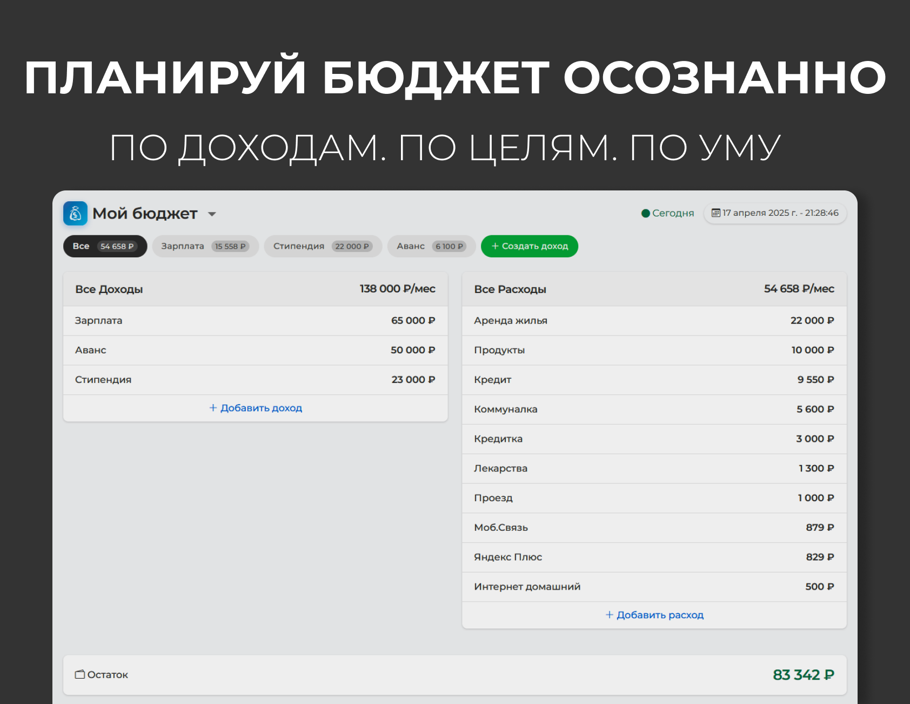

# Мой бюджет



Веб-приложение для управления личными финансами и планирования бюджета.

## Функциональность

- Учет доходов и расходов
- Связывание расходов с источниками дохода
- Финансовое прогнозирование
- Детальная статистика по доходам и расходам
- Адаптивный дизайн для мобильных устройств

## Технологии

- HTML5, CSS3, JavaScript
- Bootstrap 5 для интерфейса
- Chart.js для визуализации данных
- LocalStorage для хранения данных

## Установка и запуск

1. Клонируйте репозиторий:
   ```
   git clone https://github.com/Zaruber/moy-buget.git
   ```

2. Откройте `index.html` в вашем браузере

Или вы можете просто [открыть демо-версию](https://тутбудетсайт.com).

## Скриншоты


## Планы на будущее

- Добавление авторизации и облачного хранения данных
- Реализация стратегий накопления средств
- Импорт/экспорт данных в различных форматах
- Мобильное приложение

## Лицензия
open source MIT license 
## Автор

Zaruber - [TG](https://t.me/mpsellerhelp) 